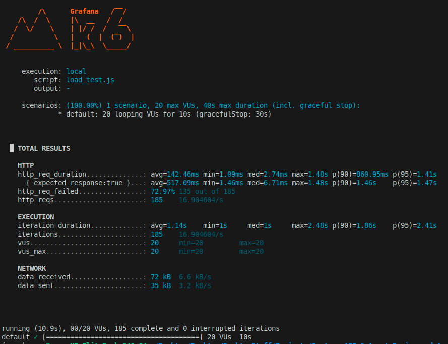

# 🚀 AI API Gateway with Guardrails

---

## 🧠 Problem

Modern LLM APIs are powerful but unsafe and expensive if exposed directly.

This project builds a **controlled AI gateway** that:

* prevents abuse (rate limiting)
* blocks malicious prompts (guardrails)
* reduces cost (caching)
* tracks usage (analytics)

---

## 🏗️ Architecture

```
Client → FastAPI Gateway
        → Auth Layer
        → Rate Limiter (Redis)
        → Guardrails
        → Usage Tracking (Redis)
        → Cache Layer (Redis)
        → LLM (Groq)
        → Response
```

---

## 🔁 Request Flow

1. User sends request with API key
2. API key is validated
3. Rate limit is checked per user (Redis)
4. Prompt is validated against guardrails
5. Usage is tracked
6. Cache is checked

   * HIT → return instantly
   * MISS → call LLM
7. Response is cached
8. Request metadata is logged

---

## ⚙️ Key Components

---

### 🔐 Authentication

* API key–based authentication
* Easily extendable to OAuth/JWT

---

### 🚫 Rate Limiting (Redis)

* Uses Redis (in-memory datastore)
* Key format:

  ```
  rate_limit:<api_key>
  ```
* Implements **INCR + TTL pattern**
* Enforces per-user request limits

**Why:**

* prevents abuse
* protects backend + LLM

---

### 🛡️ Guardrails

* Regex-based prompt filtering
* Detects prompt injection attempts

Example:

```
ignore.*previous
```

**Prevents:**

* instruction override
* unsafe LLM responses

---

### ⚡ Caching (Redis)

* Key:

  ```
  cache:<prompt>
  ```
* TTL-based caching (e.g., 5 minutes)

Flow:

```
Prompt → Cache
        → HIT → return instantly
        → MISS → call LLM → store
```

**Benefits:**

* reduces latency
* reduces LLM cost

---

### 📊 Usage Tracking

Stored in Redis:

```
usage:<api_key>
    requests
    characters
```

Tracks:

* number of requests
* prompt size (proxy for tokens)

**Enables:**

* cost estimation
* analytics
* abuse detection

---

### 🤖 LLM Integration

* Uses Groq API (OpenAI-compatible)
* Model: `llama-3.1-8b-instant`
* Abstracted via `llm_client.py`

**Design Benefit:**

* easily switch providers (OpenAI, Anthropic, local models)

---

### 📈 Logging (Observability)

Logs:

* user
* latency
* prompt size
* cache hit/miss

**Why:**

* debugging
* monitoring
* performance analysis

---

## 🧪 Load Testing

Performed using **k6 (Grafana load testing tool)**

---

### Test Setup

* 20 virtual users
* multiple API keys (multi-user simulation)
* randomized prompts
* 1-second delay (realistic user behavior)

---

### What Was Tested

* concurrent user traffic
* rate limiting behavior
* cache effectiveness
* LLM latency under load

---

### Observations

* system handled ~15–20 requests/sec
* cache significantly reduced latency
* rate limiting prevented overload
* latency showed:

  * fast path (cache / rejection)
  * slow path (LLM calls)

---

### 📊 k6 Output



---

## ⚖️ Tradeoffs

| Decision                     | Tradeoff                 |
| ---------------------------- | ------------------------ |
| Redis for cache + rate limit | fast but in-memory       |
| Regex guardrails             | simple but not foolproof |
| Per-user rate limit          | fair but requires tuning |
| Prompt-based caching         | simple but not semantic  |

---

## 🚧 Failure Scenarios

* Redis down → rate limiting + caching fail
* LLM latency spikes → slower responses
* high traffic → rate limiting triggers

---

## 🔒 Security Considerations

* API key validation
* reject-by-default strategy
* prompt guardrails for injection attacks

---

## 🔮 Future Improvements

* LLM-based moderation layer
* semantic caching
* distributed rate limiting
* async request queue
* multi-tenant support

---

## 🎤 Interview Summary

> Built an AI API gateway that enforces per-user rate limiting, prompt guardrails, caching, and usage tracking using Redis. Integrated with Groq LLM and tested under concurrent traffic using k6 to analyze latency, failure patterns, and system behavior.

---